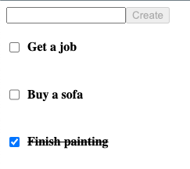

A very basic Todo app to play around with Neon Postgres and HTTP servers in Go, as well as remind myself how React works.

Using [Neon](https://neon.tech/), [Echo](https://github.com/labstack/echo), [React](https://react.dev/), [TanStack Query](https://github.com/tanstack/query), [Esbuild](https://github.com/evanw/esbuild), and [Biome](https://github.com/biomejs/biome).

